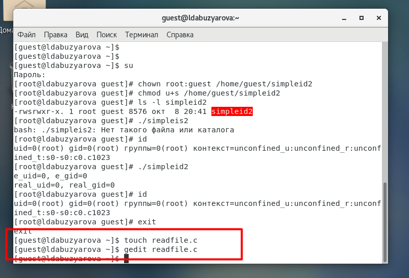

---
## Front matter
lang: ru-RU
title: Дискреционное разграничение прав в Linux. Исследование влияния дополнительных атрибутов
author: Абузярова Лейла Джамилевна	НБИбд-01-19
institute: Российский Университет Дружбы Народов
date: 8 октября, 2022, Москва, Россия

## Formatting
mainfont: PT Serif
romanfont: PT Serif
sansfont: PT Sans
monofont: PT Mono
toc: false
slide_level: 2
theme: metropolis
header-includes: 
 - \metroset{progressbar=frametitle,sectionpage=progressbar,numbering=fraction}
 - '\makeatletter'
 - '\beamer@ignorenonframefalse'
 - '\makeatother'
aspectratio: 43
section-titles: true

---

# Цели и задачи

## Цель лабораторной работы

Изучение механизмов изменения идентификаторов, применения SetUID и Sticky-битов. Получение практических навыков работы в консоли с дополнительными атрибутами. Рассмотрение работы механизма смены идентификатора процессов пользователей, а также влияние бита Sticky на запись и удаление файлов.

# Выполнение лабораторной работы

## Подготовка к работе

{ #fig:001 width=70% height=70%}

## Подготовка к работе

{ #fig:002 width=70% height=70%}

## Подготовка к работе

{ #fig:003 width=70% height=70%}

## Работа с файлом simpleid

{ #fig:004 width=70% height=70%}

## Работа с файлом simpleid

{ #fig:005 width=70% height=70%}

## Работа с файлом simpleid

{ #fig:006 width=70% height=70%}

## Работа с файлом simpleid2

{ #fig:007 width=70% height=70%}

## Работа с файлом simpleid2

{ #fig:008 width=70% height=70%}

## Работа с файлом simpleid2

{ #fig:009 width=70% height=70%}

## Работа с файлом simpleid2

{ #fig:010 width=70% height=70%}

## Работа с файлом readfile

{ #fig:011 width=70% height=70%}

## Работа с файлом readfile

{ #fig:012 width=70% height=70%}

## Работа с файлом readfile

{ #fig:013 width=70% height=70%}

## Работа с файлом readfile

{ #fig:014 width=70% height=70%}

## Работа с файлом readfile

{ #fig:015 width=70% height=70%}

## Исследование Sticky-бита

{ #fig:016 width=70% height=70%}

## Исследование Sticky-бита

{ #fig:017 width=70% height=70%}

## Исследование Sticky-бита

{ #fig:018 width=70% height=70%}

# Выводы

## Результаты выполнения лабораторной работы

Изучили механизмы изменения идентификаторов, применения SetUID- и Sticky-битов. Получили практические навыки работы в консоли с дополнительными атрибутами. Также мы рассмотрели работу механизма смены идентификатора процессов пользователей и влияние бита Sticky на запись и удаление файлов.