---
# Front matter
title: "Отчёт по лабораторной работе №5"
subtitle: "Дискреционное разграничение прав в Linux. Исследование влияния дополнительных атрибутов"
author: "Абузярова Лейла Джамилевна	НБИбд-01-19"

# Generic otions
lang: ru-RU
toc-title: "Содержание"

# Bibliography
bibliography: bib/cite.bib
csl: pandoc/csl/gost-r-7-0-5-2008-numeric.csl

# Pdf output format
toc: true # Table of contents
toc_depth: 2
lof: true # List of figures
fontsize: 12pt
linestretch: 1.5
papersize: a4
documentclass: scrreprt
## I18n
polyglossia-lang:
  name: russian
  options:
	- spelling=modern
	- babelshorthands=true
polyglossia-otherlangs:
  name: english
### Fonts
mainfont: PT Serif
romanfont: PT Serif
sansfont: PT Sans
monofont: PT Mono
mainfontoptions: Ligatures=TeX
romanfontoptions: Ligatures=TeX
sansfontoptions: Ligatures=TeX,Scale=MatchLowercase
monofontoptions: Scale=MatchLowercase,Scale=0.9
## Biblatex
biblatex: true
biblio-style: "gost-numeric"
biblatexoptions:
  - parentracker=true
  - backend=biber
  - hyperref=auto
  - language=auto
  - autolang=other*
  - citestyle=gost-numeric
## Misc options
indent: true
header-includes:
  - \linepenalty=10 # the penalty added to the badness of each line within a paragraph (no associated penalty node) Increasing the value makes tex try to have fewer lines in the paragraph.
  - \interlinepenalty=0 # value of the penalty (node) added after each line of a paragraph.
  - \hyphenpenalty=50 # the penalty for line breaking at an automatically inserted hyphen
  - \exhyphenpenalty=50 # the penalty for line breaking at an explicit hyphen
  - \binoppenalty=700 # the penalty for breaking a line at a binary operator
  - \relpenalty=500 # the penalty for breaking a line at a relation
  - \clubpenalty=150 # extra penalty for breaking after first line of a paragraph
  - \widowpenalty=150 # extra penalty for breaking before last line of a paragraph
  - \displaywidowpenalty=50 # extra penalty for breaking before last line before a display math
  - \brokenpenalty=100 # extra penalty for page breaking after a hyphenated line
  - \predisplaypenalty=10000 # penalty for breaking before a display
  - \postdisplaypenalty=0 # penalty for breaking after a display
  - \floatingpenalty = 20000 # penalty for splitting an insertion (can only be split footnote in standard LaTeX)
  - \raggedbottom # or \flushbottom
  - \usepackage{float} # keep figures where there are in the text
  - \floatplacement{figure}{H} # keep figures where there are in the text
---

# Цель работы

Изучение механизмов изменения идентификаторов, применения SetUID и Sticky-битов. Получение практических навыков работы в консоли с дополнительными атрибутами. Рассмотрение работы механизма смены идентификатора процессов пользователей, а также влияние бита Sticky на запись и удаление файлов.

# Выполнение лабораторной работы

## Подготовка

Для выполнения части заданий требуются средства разработки приложений. Поэтому установим копилятор gcc командой yum install gcc.

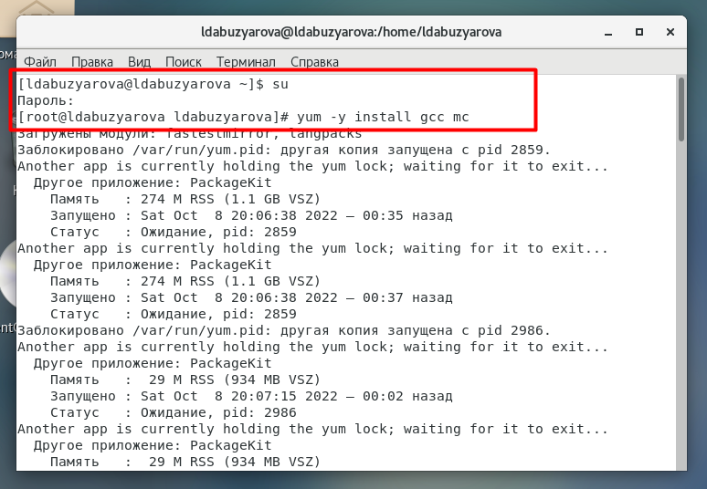{ #fig:001 width=70% height=70%}

Чтобы система защиты SELinux не мешала выполнению заданий работы, отключили систему запретов до очередной перезагрузки системы командой setenforce 0. Команда getenforce вывела Permissive:

{ #fig:002 width=70% height=70%}

Теперь проверим корректность установки компилятора, как показано на скриншоте номер 3.

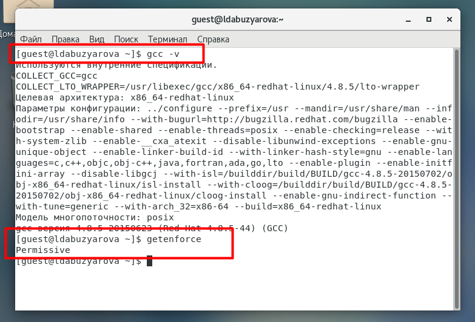{ #fig:003 width=70% height=70%}

## Изучение механики SetUID

Вошли в систему от имени пользователя guest. Сздали папку laba5, создали файл simpleid.c. Начали редактирование данного файла.

{ #fig:004 width=70% height=70%}

Написали следующую программу в файле simpleid.c.

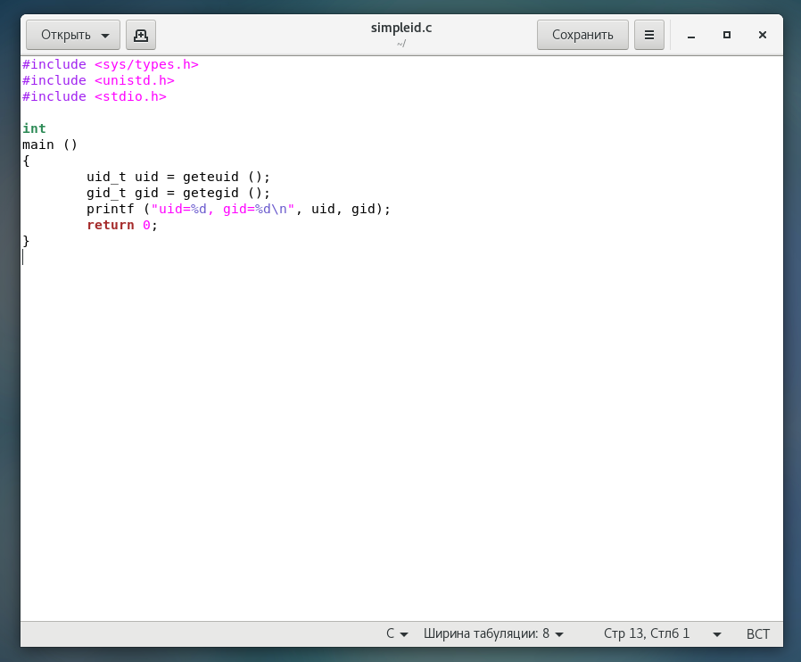{ #fig:005 width=70% height=70%}

Скомпилировали программу и убедились, что файл программы создан: gcc simpleid.c -o simpleid. Выполнили программу simpleid командой ./simpleid. Выполнили системную программу id с помощью команды id. uid и gid совпадает в обеих программах

{ #fig:006 width=70% height=70%}

Усложнили программу, добавив вывод действительных идентификаторов. Проделываем те же операции, что и с предыдущим файлом.

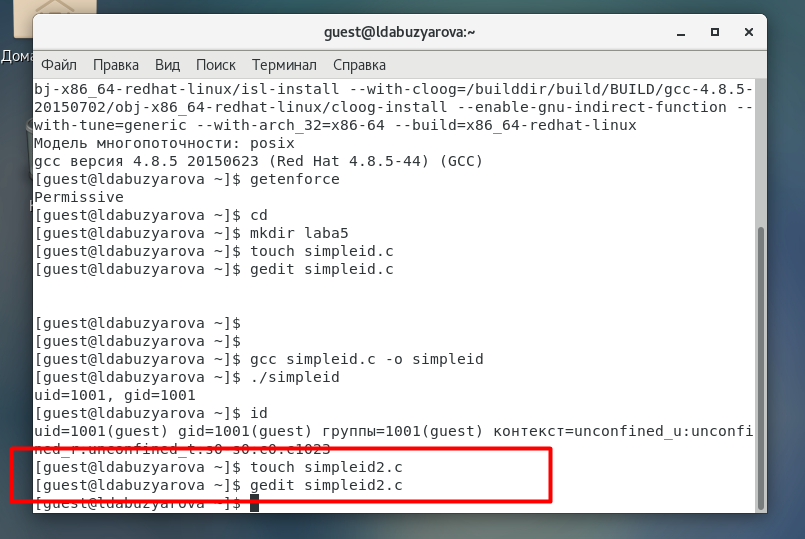{ #fig:007 width=70% height=70%}

Написали следующую программу в файле simpleid2.c.

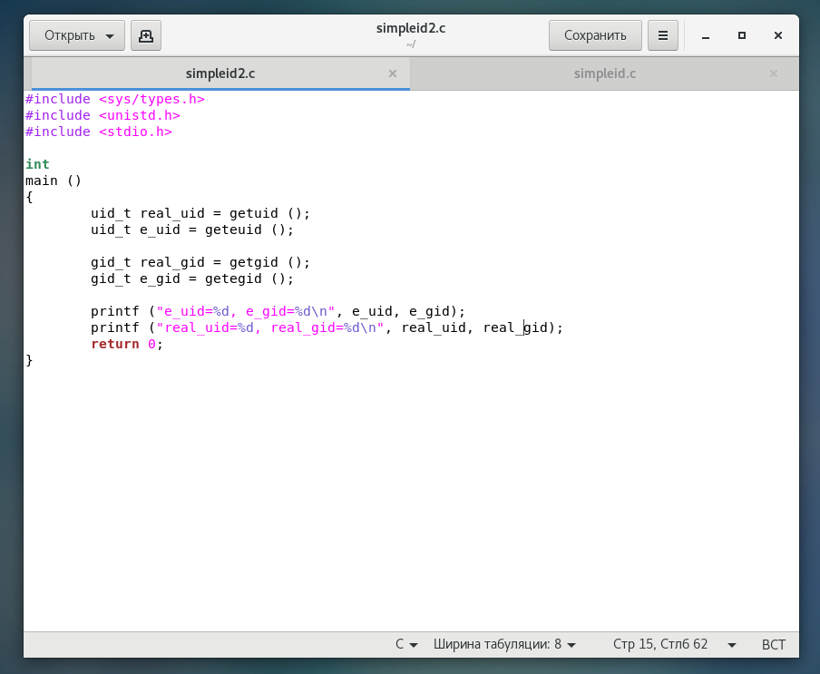{ #fig:008 width=70% height=70%}

Скомпилировали и запустили simpleid2.c. 

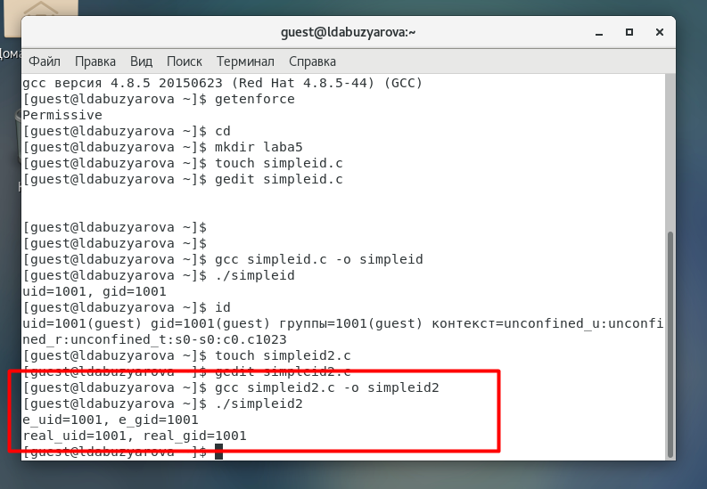{ #fig:009 width=70% height=70%}

На скриншоте 10 видно следующее: теперь от имени суперпользователя выполнили команды, которые меняют владельца файла. Использовали su для повышения прав до суперпользователя. Выполнили проверку правильности установки новых атрибутов и смены владельца файла simpleid2. Также запустили simpleid2 и id.

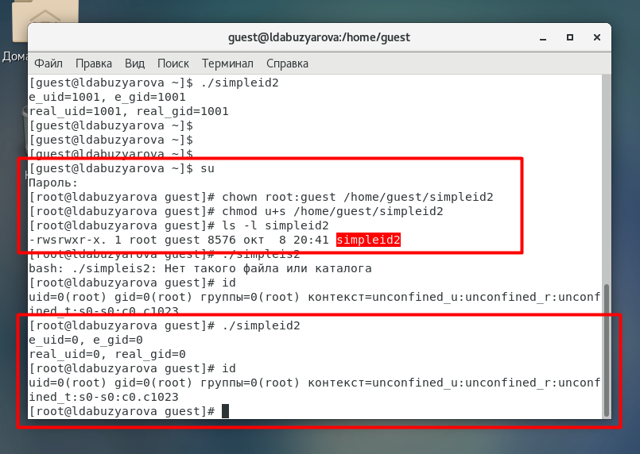{ #fig:010 width=70% height=70%}

Приходим к выводу, что результат выполнения программ при заходе от пользователя guest и через root отличается.

Теперь создадим файл readfile.c, применяя те же команды, что и в предыдущий раз.

{ #fig:011 width=70% height=70%}

Написали программу readfile.c

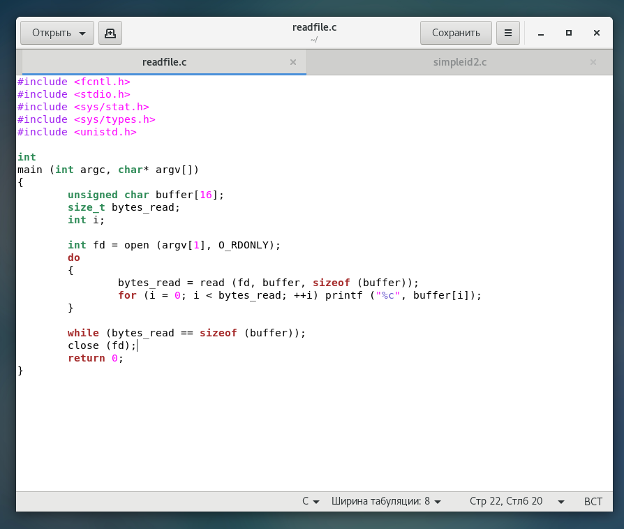{ #fig:012 width=70% height=70%}

Откомпилировали программу. Затем сменили владельца у файла readfile.c и изменили права так, чтобы только суперпользователь (root) мог прочитать его, a guest не мог. 

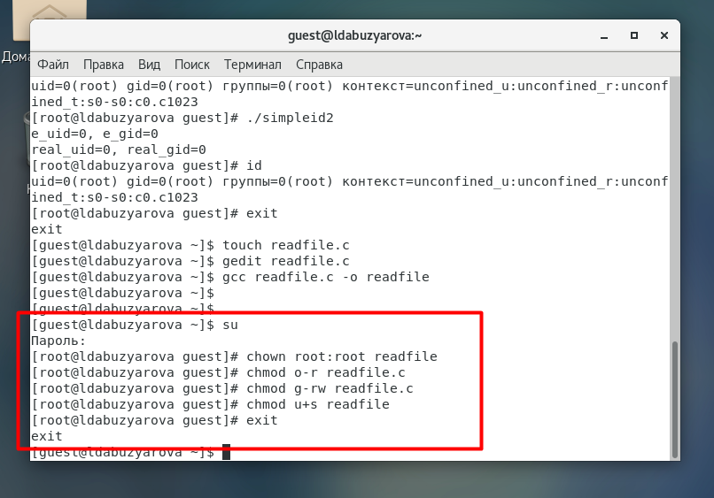{ #fig:013 width=70% height=70%}

Проверили, что пользователь guest не может прочитать файл readfile.c. Но увидели, что файл читается.

{ #fig:014 width=70% height=70%}

Ищем ошибку. Оказалось, что была допущена ошибка в установке прав. Переделали команду с установкой прав и повторили проверку, на этот раз в доступе отказано, как и должно быть. А команда ./readfile сработала потому что она выполняет чтение от имени суперпользователя, а не guest.

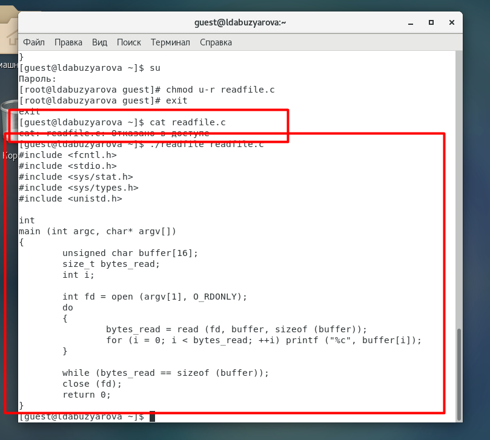{ #fig:015 width=70% height=70%}

## Исследование Sticky-бита

От имени пользователя guest создали файл file01.txt в директории /tmp со словом test. Просмотрели атрибуты у только что созданного файла и разрешили чтение и запись для категории пользователей «все остальные». Первоначально все группы имели право на чтение, а запись могли осуществлять все, кроме «остальных пользователей».

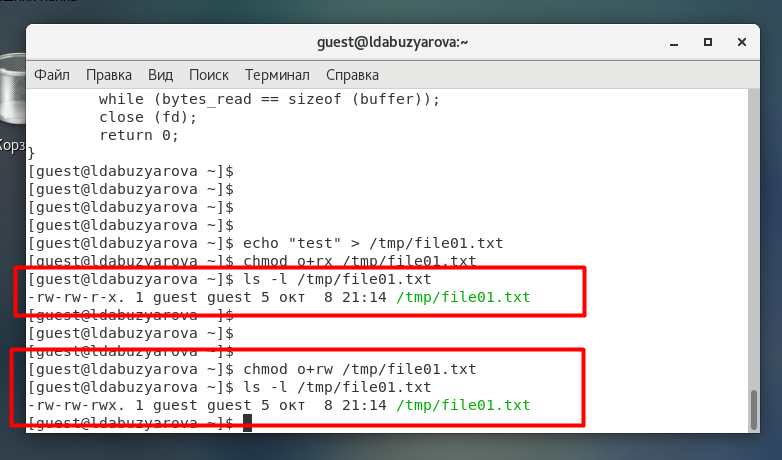{ #fig:016 width=70% height=70%}

От пользователя (не являющегося владельцем) попробовали прочитать файл /file01.txt. Мы видим, что в файле записано одно слово. далее к нему мы должны были поочередно дозаписать слова test2 и test3, но я забыла добавить по одной галочке и вместо дозаписи перезаписала слова.

От пользователя попробовали удалить файл /tmp/file01.txt командой rm /tmp/file01.txt, однако получила отказ.

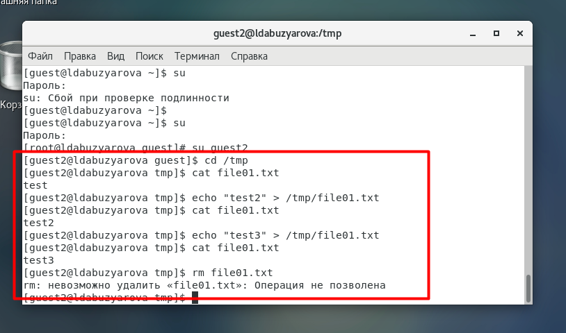{ #fig:017 width=70% height=70%}

От суперпользователя командой выполнили команду, снимающую атрибут t (Sticky-бит) с директории /tmp. Покинули режим суперпользователя командой exit. От пользователя  проверили, что атрибута t у директории /tmp нет. Повторили предыдущие шаги. Получилось удалить файл. 

{ #fig:018 width=70% height=70%}

# Выводы

Изучили механизмы изменения идентификаторов, применения SetUID- и Sticky-битов. Получили практические навыки работы в консоли с дополнительными атрибутами. Также мы рассмотрели работу механизма смены идентификатора процессов пользователей и влияние бита Sticky на запись и удаление файлов.

# Список литературы{.unnumbered}

1. [КОМАНДА CHATTR В LINUX](https://losst.ru/neizmenyaemye-fajly-v-linux)
2. [chattr](https://en.wikipedia.org/wiki/Chattr)
