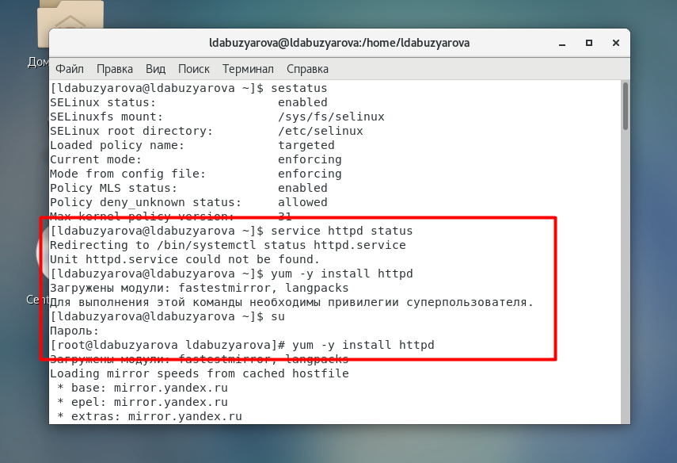

---
## Front matter
lang: ru-RU
title: Знакомство с SELinux
author: Абузярова Лейла Дамилевна	НБИбд-01-19
institute: Российский Университет Дружбы Народов
date: 15 октября, 2022, Москва, Россия

## Formatting
mainfont: PT Serif
romanfont: PT Serif
sansfont: PT Sans
monofont: PT Mono
toc: false
slide_level: 2
theme: metropolis
header-includes: 
 - \metroset{progressbar=frametitle,sectionpage=progressbar,numbering=fraction}
 - '\makeatletter'
 - '\beamer@ignorenonframefalse'
 - '\makeatother'
aspectratio: 43
section-titles: true

---

# Цели и задачи

## Цель лабораторной работы

Развить навыки администрирования ОС Linux. Получить первое практическое знакомство с технологией SELinux. Проверить работу SELinx на практике совместно с веб-сервером Apache.

# Выполнение лабораторной работы

## Запуск HTTP-сервера

{ #fig:001 width=70% height=70%}

## Запуск HTTP-сервера

{ #fig:002 width=70% height=70%}

## Запуск HTTP-сервера

{ #fig:003 width=70% height=70%}

## Запуск HTTP-сервера

{ #fig:004 width=70% height=70%}

## Проверка контекста файлов

{ #fig:005 width=70% height=70%}

## Создание html-файла

{ #fig:006 width=70% height=70%}

## Работа с html-файлом

{ #fig:007 width=70% height=70%}

## Изменение контекста безопасности

{ #fig:008 width=70% height=70%}

## Изменение контекста безопасности

{ #fig:009 width=70% height=70%}

## Последствия изменения контекста

{ #fig:010 width=70% height=70%}

## Последствия изменения контекста

{ #fig:011 width=70% height=70%}

## Переключение порта и восстановление контекста безопасности

{ #fig:012 width=70% height=70%}

## Переключение порта и восстановление контекста безопасности

{ #fig:013 width=70% height=70%}

## Переключение порта и восстановление контекста безопасности

{ #fig:014 width=70% height=70%}

## Переключение порта и восстановление контекста безопасности

{ #fig:015 width=70% height=70%}

## Переключение порта и восстановление контекста безопасности

{ #fig:016 width=70% height=70%}

## Удаление 81 порта

{ #fig:017 width=70% height=70%}

## Удаление файла

{ #fig:018 width=70% height=70%}

# Выводы

## Результаты выполнения лабораторной работы

В процессе выполнения лабораторной работы мною были получены базовые навыки работы с технологией seLinux.