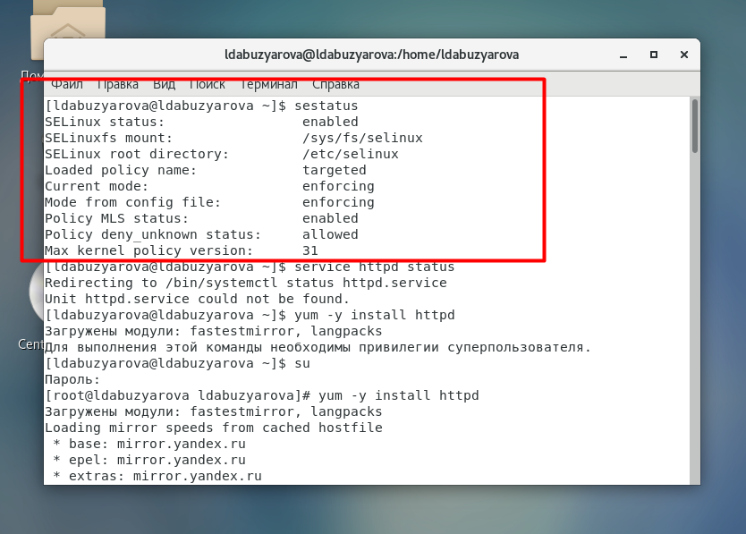
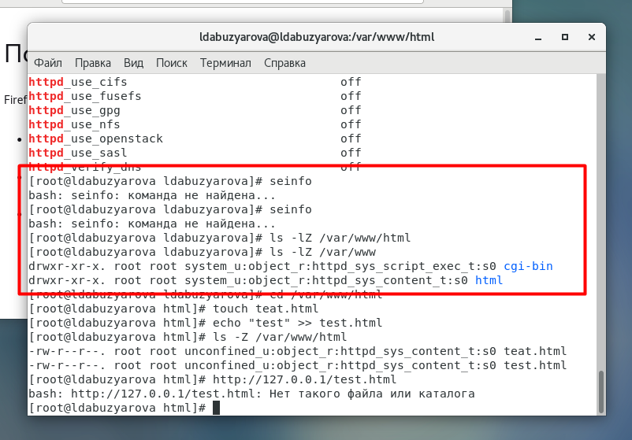
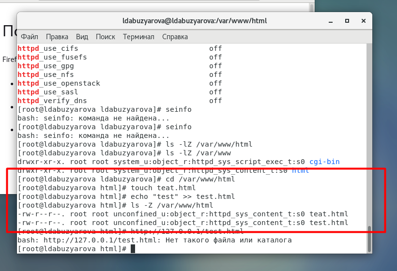
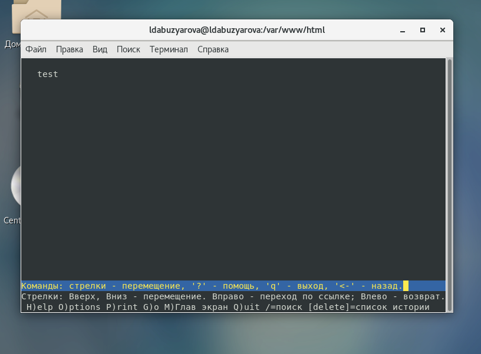
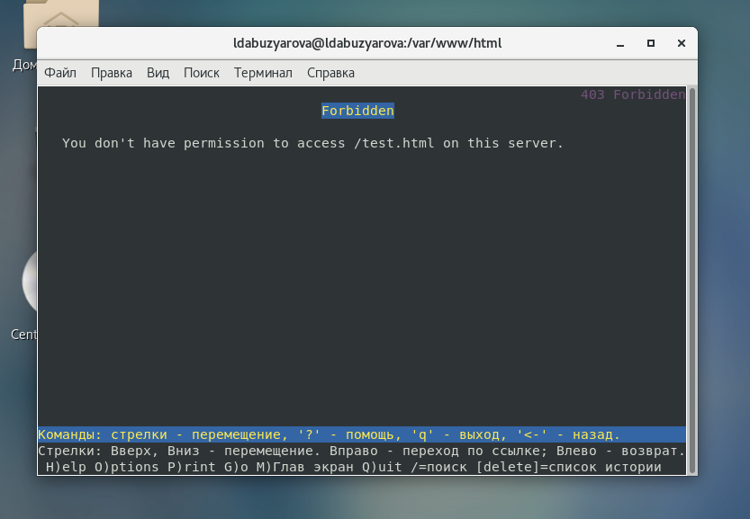
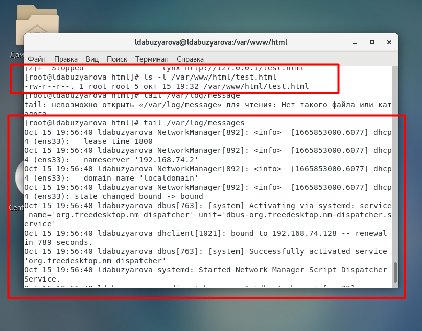
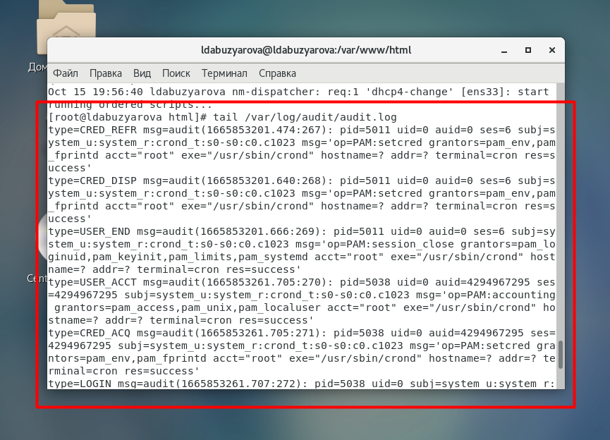
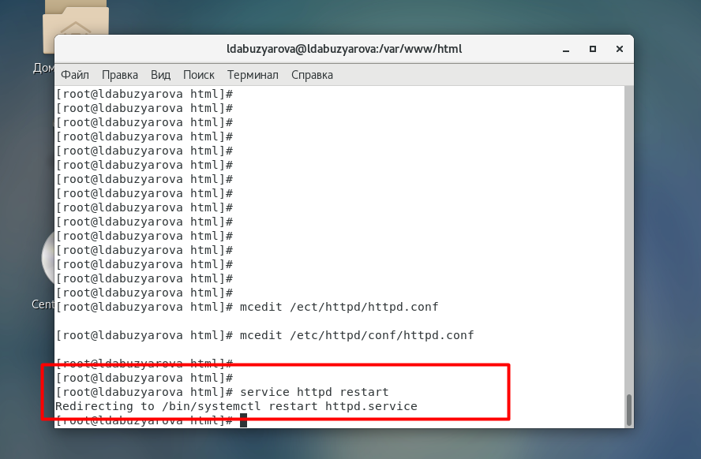
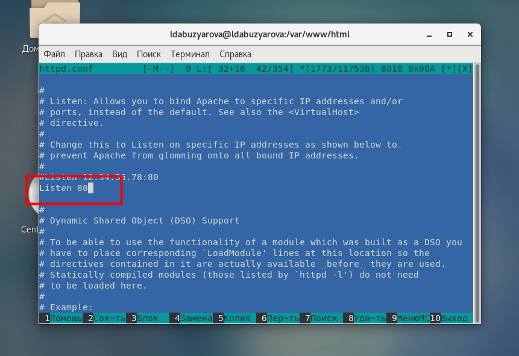

---
# Front matter
title: "Отчёт по лабораторной работе №6"
subtitle: "Мандатное разгрвничение прав в Linux"
author: "Абузярова Лейла Джамилевна	НБИбд-01-19"

# Generic otions
lang: ru-RU
toc-title: "Содержание"

# Bibliography
bibliography: bib/cite.bib
csl: pandoc/csl/gost-r-7-0-5-2008-numeric.csl

# Pdf output format
toc: true # Table of contents
toc_depth: 2
lof: true # List of figures
fontsize: 12pt
linestretch: 1.5
papersize: a4
documentclass: scrreprt
## I18n
polyglossia-lang:
  name: russian
  options:
	- spelling=modern
	- babelshorthands=true
polyglossia-otherlangs:
  name: english
### Fonts
mainfont: PT Serif
romanfont: PT Serif
sansfont: PT Sans
monofont: PT Mono
mainfontoptions: Ligatures=TeX
romanfontoptions: Ligatures=TeX
sansfontoptions: Ligatures=TeX,Scale=MatchLowercase
monofontoptions: Scale=MatchLowercase,Scale=0.9
## Biblatex
biblatex: true
biblio-style: "gost-numeric"
biblatexoptions:
  - parentracker=true
  - backend=biber
  - hyperref=auto
  - language=auto
  - autolang=other*
  - citestyle=gost-numeric
## Misc options
indent: true
header-includes:
  - \linepenalty=10 # the penalty added to the badness of each line within a paragraph (no associated penalty node) Increasing the value makes tex try to have fewer lines in the paragraph.
  - \interlinepenalty=0 # value of the penalty (node) added after each line of a paragraph.
  - \hyphenpenalty=50 # the penalty for line breaking at an automatically inserted hyphen
  - \exhyphenpenalty=50 # the penalty for line breaking at an explicit hyphen
  - \binoppenalty=700 # the penalty for breaking a line at a binary operator
  - \relpenalty=500 # the penalty for breaking a line at a relation
  - \clubpenalty=150 # extra penalty for breaking after first line of a paragraph
  - \widowpenalty=150 # extra penalty for breaking before last line of a paragraph
  - \displaywidowpenalty=50 # extra penalty for breaking before last line before a display math
  - \brokenpenalty=100 # extra penalty for page breaking after a hyphenated line
  - \predisplaypenalty=10000 # penalty for breaking before a display
  - \postdisplaypenalty=0 # penalty for breaking after a display
  - \floatingpenalty = 20000 # penalty for splitting an insertion (can only be split footnote in standard LaTeX)
  - \raggedbottom # or \flushbottom
  - \usepackage{float} # keep figures where there are in the text
  - \floatplacement{figure}{H} # keep figures where there are in the text
---

# Цель работы

Развить навыки администрирования ОС Linux. Получить первое практическое знакомство с технологией SELinux. Проверить работу SELinx на практике совместно с веб-сервером Apache.

# Выполнение лабораторной работы

## Изучение механики SetUID

Вошли в систему и убедитесь, что SELinux работает в режиме enforcing политики targeted с помощью команд getenforce иили sestatus. 

{ #fig:001 width=70% height=70%}

Установили пакет httpd, как показано на рисунке 2.

{ #fig:002 width=70% height=70%}

Далее с помощью команды servoce httpd status проверяем запущена ли служба, на рисунке 3 видно, что служба не запущена. В дальнейшем в ходе лабораторной работы служба будет запущена. Также найдем веб-сервер Apache в списке процессов, определим его контекст безопасности. Можно использовать команду ps auxZ | grep httpd или ps -eZ | grep httpd 

{ #fig:003 width=70% height=70%}

Посмотрим текущее состояние переключателей SELinux для Apache с помощью команды sestatus -b | grep httpd Обратите внимание, что многие из них находятся в положении «off». 

{ #fig:004 width=70% height=70%}

Посмотрим статистику по политике с помощью команды seinfo, однако в данной версии операционной системы такой команды нет. К сожалению найти аналогов команды я не смогла. Определим тип файлов и поддиректорий, находящихся в директории /var/www, с помощью команды ls -lZ /var/www. В поддиректориях могут располагаться системные скрипты и контент для http. Определите тип файлов, находящихся в директории /var/www/html: ls -lZ /var/www/html. В директории изначально нет файлов.

{ #fig:005 width=70% height=70%}

Определите круг пользователей, которым разрешено создание файлов в директории /var/www/html. Создавать файлы может только root. Создадим от имени суперпользователя (так как в дистрибутиве после установки только ему разрешена запись в директорию) html-файл /var/www/html/test.html следующего содержания:  Test. Проверим контекст созданного нами файла.

{ #fig:006 width=70% height=70%}

Обратимся к файлу через веб-сервер, введя в браузере адрес http://127.0.0.1/test.html. К сожалению, по каким-то причинам в браузере у меня выходила ошибка, поэтому я воспользовалась консольным браузером, применяя компанду lynx. на рисунке 7 виден результат данной команды.

{ #fig:007 width=70% height=70%}

Изучим справку man httpd_selinux и выясним, какие контексты файлов определены для httpd. К сожалению, данная команда тоже не сработала. Далее определяем контексты типа файла test.html. Проверить контекст файла можно командой ls -Z. ls -Z /var/www/html/test.html. Основным контекстом является httpd_sys_content_t, его мы и увидели в выводе команды, который изображен на рисунке 8. Изменим контекст файла /var/www/html/test.html с httpd_sys_content_t на любой другой, к которому процесс httpd не должен иметь доступа, например, на samba_share_t: chcon -t samba_share_t /var/www/html/test.html ls -Z /var/www/html/test.html После этого контекст поменялся.

{ #fig:008 width=70% height=70%}

Попробуем ещё раз получить доступ к файлу через веб-сервер, в моём случае через консольный браузер. Получаем сообщение об ошибке: Forbidden You don't have permission to access /test.html on this server. При изменении контекста файл стал считаться чужим для http и программа не может его прочитать.

{ #fig:009 width=70% height=70%}

Проанализируем ситуацию. Согласно выводу команды ls -l /var/www/html/test.html файл на чтение доступен, но так как ранее мы сменили контекст, то в браузере выходит ошибка. Теперь просмотрим log-файлы веб-сервера Apache. Также просмотрим системный лог-файл: tail /var/log/messages. 

{ #fig:010 width=70% height=70%}

Если в системе окажутся запущенными процессы setroubleshootd и audtd, то мы также сможем увидеть ошибки, аналогичные указанным выше, в файле /var/log/audit/audit.log. Убеждаемся в ошибке.

{ #fig:011 width=70% height=70%}

Попробуем запустить веб-сервер Apache на прослушивание ТСР-порта 81 (а не 80, как рекомендует IANA и прописано в /etc/services). Для этого в файле /etc/httpd/httpd.conf найдите строчку Listen 80 и замените её на Listen 81.

{ #fig:012 width=70% height=70%}

Выполним перезапуск веб-сервера Apache. Сбой не происходит, порт 81 уже вписан в разрешенные.

{ #fig:013 width=70% height=70%}

Выполним команду semanage port -a -t http_port_t -р tcp 81. После этого проверьте список портов командой semanage port -l | grep http_port_t Убедитесь, что порт 81 появился в списке.

{ #fig:014 width=70% height=70%}

Попробуем запустить веб-сервер Apache ещё раз. Все работает. Вернем контекст httpd_sys_cоntent__t к файлу /var/www/html/ test.html: chcon -t httpd_sys_content_t /var/www/html/test.html После этого попробуйте получить доступ к файлу через веб-сервер, введя в браузере адрес http://127.0.0.1:81/test.html. Мы видмть содержимое файла — слово «test», на рисунке 15.

{ #fig:015 width=70% height=70%}

Исправим обратно конфигурационный файл apache, вернув Listen 80, как показано на рисунке 16.

{ #fig:016 width=70% height=70%}

Попробуем удалить привязку http_port_t к 81 порту: semanage port -d -t http_port_t -p tcp 81. Однако, порт не может быть удален, потмоу тчо является системным и отвечает за установление связи между хостами.

{ #fig:017 width=70% height=70%}

Удалим файл /var/www/html/test.html: rm /var/www/html/test.html, как показано на рисунке 18.

{ #fig:018 width=70% height=70%}

# Выводы

В процессе выполнения лабораторной работы мною были получены базовые навыки работы с технологией seLinux.

# Список литературы{.unnumbered}

1. [SELinux в CentOS](https://access.redhat.com/documentation/en-us/red_hat_enterprise_linux/6/html/security-enhanced_linux/index)
2. [Веб-сервер Apache](https://httpd.apache.org/)
